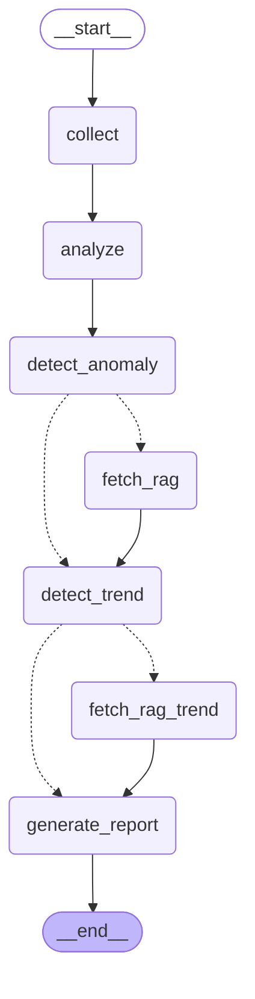

# AirGuard

Telegram-бот, который анализирует качество воздуха и дает персональные рекомендации аллергикам и астматикам с помощью мультиагентного LangGraph-пайплайна.

## Что делает бот

AirGuard следит за качеством воздуха и предупреждает когда выходить на улицу
опасно — с учётом вашего здоровья. Аллергику важна пыльца, астматику —
загрязнение воздуха, чувствительному к солнцу — UV-индекс. Бот знает ваш
профиль и реагирует только на то, что важно именно вам.

Главное отличие от обычных приложений с погодой: бот не просто фиксирует
текущее состояние, а отслеживает тренд и предупреждает заранее — пока
ещё есть время принять меры. Рекомендации основаны на нормативах ВОЗ.

В зависимости от ситуации бот отправляет один из четырёх типов алертов:

- **OK** — всё в норме
- **Warning** — превышен персональный порог, стоит ограничить время на улице
- **Urgent** — опасная зона или аномальный скачок (возможен пожар, выброс, инверсия)
- **Preventive** — сейчас норма, но тренд указывает на ухудшение через 1-2 часа

## Используемые API

- **OpenAQ** — PM2.5, PM10, NO2, O3 от государственных станций мониторинга. API v3, радиус поиска 25 км. [openaq.org](https://openaq.org)
- **Open-Meteo** — пыльца деревьев (берёза) и трав. Без ключа. [open-meteo.com](https://open-meteo.com/en/docs/air-quality-api)
- **OpenUV** — UV-индекс по координатам. [openuv.io](https://www.openuv.io)
- **Groq** — LLM (llama-3.3-70b-versatile) для генерации персонализированных сообщений. [console.groq.com](https://console.groq.com)
- **LangFuse** — трейсы графа: промпт, ответ, latency, токены. [cloud.langfuse.com](https://cloud.langfuse.com)

## Архитектура

```
Telegram /check
      |
      v
+--------------+
|  Bot Handler |
+------+-------+
       |  invoke(state)
       v
+------------------------------------------------------+
|               LangGraph StateGraph                    |
|                                                       |
|  [collect] -> [analyze] -> [detect_anomaly]           |
|                                  |                    |
|              +-------------------+                    |
|              v аномалия/danger   v нет аномалии       |
|          [fetch_rag]        [detect_trend]            |
|              +------------------>|                    |
|                         +--------+                    |
|                         v        v тренд ок           |
|                  [fetch_rag_trend] [generate_report]  |
|                         +------->|                    |
|                                  v                    |
|                            [generate_report]          |
|                                  |                    |
|                                 END                   |
+------------------------------------------------------+
       |
       v
Telegram-сообщение пользователю
```

## Граф (LangGraph)



**Ветвление 1** (`route_after_anomaly`): аномалия или danger -> `fetch_rag`, иначе -> `detect_trend`.

**Ветвление 2** (`route_after_trend`): тренд вверх и прогноз выше порога -> `fetch_rag_trend`, иначе -> `generate_report`.

## Стек

| Компонент | Инструмент |
|-----------|-----------|
| Язык | Python 3.11+ |
| LLM | Groq API (llama-3.3-70b-versatile) |
| Agent Framework | LangGraph 0.2+ (StateGraph) |
| RAG | LangChain + FAISS |
| Embeddings | sentence-transformers/all-MiniLM-L6-v2 |
| Observability | LangFuse Cloud |
| БД | SQLite |
| Telegram | python-telegram-bot 21.x |
| Пакетный менеджер | uv |

## Быстрый старт

```bash
# Установить uv (один раз)
curl -LsSf https://astral.sh/uv/install.sh | sh

# Клонировать и настроить
git clone <repo-url> && cd airguard
cp .env.example .env
# Заполнить ключи в .env

# Установить зависимости
uv sync

# Первый запуск (один раз)
uv run python -m airguard.rag.builder    # построить RAG-индекс
uv run python -m airguard.db.models      # создать БД

# Запустить бота
uv run python -m airguard.main
```

## Команды бота

| Команда | Описание |
|---------|---------|
| `/start` | Регистрация пользователя |
| `/check` | Проверка качества воздуха (rate limit: 10 сек) |
| `/settings` | Просмотр/изменение профиля (локация, диагноз, аллергены) |
| `/report` | Последние 5 замеров |

## Метрики

| Метрика | Значение |
|---------|---------|
| Benchmark success rate | 10/10 (100%) |
| Asserts | 8/8 |
| Tool checker | 3/3 |
| LLM judge | 5/5 |
| E2E (3 города) | 3/3 |
| LLM latency | ~0.6s (Groq) |
| E2E latency | 2–9s (зависит от API) |
| Cost per run | $0 (Groq Free tier) |

Финальный прогон: 2026-06-21.

## Eval

```bash
uv run python -m airguard.eval.benchmark      # 10 тест-кейсов
uv run python -m airguard.eval.asserts         # программные проверки
uv run python -m airguard.eval.tool_checker    # проверка tool-вызовов
uv run python -m airguard.eval.llm_judge       # LLM-as-judge
uv run python -m airguard.eval.e2e             # end-to-end (real APIs)
```

## Security

| # | Пункт | Статус |
|---|-------|--------|
| 1 | API-ключи в `.env`, не в коде | Да |
| 2 | `.env` в `.gitignore` | Да |
| 3 | Параметризованные SQL-запросы | Да |
| 4 | Валидация координат | Да |
| 5 | Rate limiting (10 сек/пользователь) | Да |
| 6 | Timeout на внешние API (10s) | Да |
| 7 | Обработка ошибок API (fallback) | Да |

## Структура проекта

```
airguard/
├── graph/          # LangGraph StateGraph
│   ├── state.py    # AirGuardState (TypedDict)
│   ├── nodes.py    # 7 узлов графа
│   ├── edges.py    # 2 роутера (условные переходы)
│   └── builder.py  # сборка и компиляция графа
├── tools/          # инструменты
│   ├── aqi_tool.py          # OpenAQ -> PM2.5, PM10, NO2, O3
│   ├── pollen_uv_tool.py    # Open-Meteo + OpenUV -> пыльца, UV
│   └── calculator_tool.py   # personal score + z-score аномалий
├── rag/            # база знаний
│   ├── builder.py           # построение FAISS-индекса
│   ├── retriever.py         # поиск по индексу
│   └── documents/           # 4 документа (ВОЗ, астма, пыльца, аномалии)
├── db/             # SQLite
│   ├── models.py            # схема БД
│   └── repository.py        # CRUD
├── bot/            # Telegram
│   └── handlers.py          # /start /check /settings /report
├── eval/           # оценка качества
│   ├── benchmark.py         # 10 тест-кейсов
│   ├── asserts.py           # программные проверки
│   ├── llm_judge.py         # LLM-as-judge
│   └── tool_checker.py      # проверка tool-вызовов
├── config.py       # загрузка .env
└── main.py         # точка входа
```
